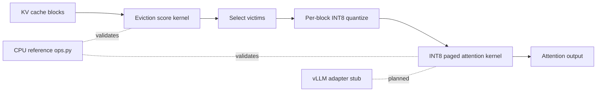

# PagedKV Fusion

### Custom CUDA kernels for KV-cache eviction scoring and INT8 paged attention with vLLM adapter stubs

[](https://github.com/ArchanaChetan07/PagedKV-Fusion-Custom-CUDA-Kernels-for-KV-Cache-Eviction-Quantized-Paged-Attention/actions/workflows/ci.yml)
[](https://www.python.org/)
[](tests/)
[](csrc/)

Research implementation of **fused eviction scoring** and **INT8 paged attention** kernels for long-context LLM serving. CPU reference math is fully tested; CUDA kernels are validated against references on NVIDIA hardware. Includes honest validation report, benchmark JSON artifacts, and vLLM integration adapter code (**not yet exercised in-process**).

---

## Key Results

| Metric | Value | Source |
|---|---|---|
| pytest test functions | **20** | `tests/test_*.py` |
| Eviction CUDA speedup (16,384 blocks) | **3.0×** (562 µs vs 1708 µs p50) | `docs/VALIDATION_REPORT.md` §5b |
| INT8 attn vs fp16 SDPA (32 seq × 1024 len) | **21×** (3.34 ms vs 70 ms p50) | `docs/VALIDATION_REPORT.md` §7b |
| INT8 KV RAM vs fp16 (theoretical) | **~50%** | `docs/VALIDATION_REPORT.md` §4 |
| GPU validated | NVIDIA T1000, CUDA 12.5 | `docs/VALIDATION_REPORT.md` |
| vLLM in-process integration | **Not run** (adapter only) | `integration/vllm/` |
| Languages | Python, CUDA, C++ | `csrc/`, `pagedkv/` |

---

## Architecture



**How it works:** eviction scores combine attention mass, recency, and frequency terms; low-scoring blocks are quantized per-(block, head) to INT8; a fused CUDA attention kernel gathers paged blocks and approximates fp32 outputs. All math is cross-checked against NumPy/PyTorch references before GPU gates run.

---

## Tech Stack

| Layer | Choice |
|---|---|
| Reference | NumPy + PyTorch (`pagedkv/ops.py`) |
| Kernels | CUDA (`csrc/eviction.cu`, `csrc/attention.cu`) |
| Tests | pytest CPU + optional `test_kernels_gpu.py` |
| Benchmarks | `benchmarks/`, `results/*.json` |
| Integration | vLLM patch scaffold (`integration/vllm/`) |
| Build | `Makefile`, `pyproject.toml` extras `[cuda,dev]` |

---

## Features

- Deterministic eviction tie-breaking and empty-block edge cases
- INT8 round-trip error bounded by scale/2 (proven in tests)
- End-to-end demo script (`scripts/run_end_to_end_demo.py`)
- Honest validation report labeling simulated vs measured claims
- Nsight profiling script (blocked on GPU counter permissions in dev env)

---

## Installation & Usage

```bash
git clone https://github.com/ArchanaChetan07/PagedKV-Fusion-Custom-CUDA-Kernels-for-KV-Cache-Eviction-Quantized-Paged-Attention.git
cd PagedKV-Fusion-Custom-CUDA-Kernels-for-KV-Cache-Eviction-Quantized-Paged-Attention
pip install -e ".[dev]"
pytest tests/ -v
```

```bash
# Full pipeline demo (CPU reference)
python scripts/run_end_to_end_demo.py

# GPU kernel tests (requires CUDA build)
PAGEDKV_FORCE_CUDA=1 pip install -e ".[cuda,dev]"
pytest tests/test_kernels_gpu.py -v
```

---

## Project Structure

```text
PagedKV-Fusion-.../
├── pagedkv/           # reference ops + dispatch
├── csrc/              # CUDA kernels
├── tests/             # 20 pytest functions
├── benchmarks/        # eviction, quant, downstream proxy
├── results/           # committed benchmark JSON
├── integration/vllm/  # adapter (not integration-tested)
└── docs/VALIDATION_REPORT.md
```

---

## License

See repository license file if present.
