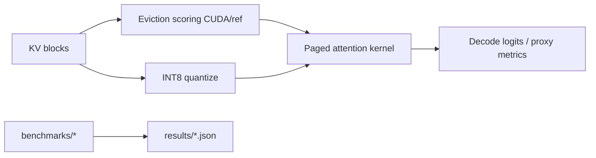
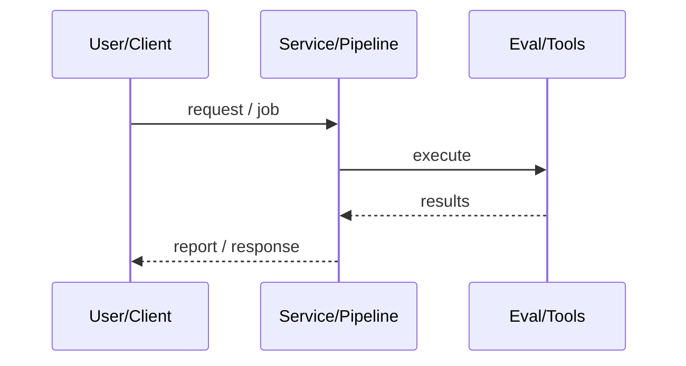
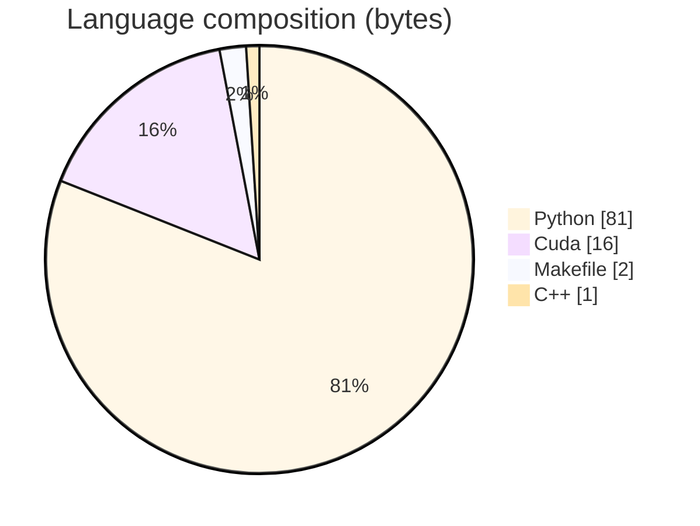

# PagedKV-Fusion

### Custom CUDA kernels for KV-cache eviction scoring and INT8 quantized paged attention with a pluggable vLLM-oriented backend.

[](https://github.com/ArchanaChetan07/PagedKV-Fusion-Custom-CUDA-Kernels-for-KV-Cache-Eviction-Quantized-Paged-Attention)
[](https://github.com/ArchanaChetan07/PagedKV-Fusion-Custom-CUDA-Kernels-for-KV-Cache-Eviction-Quantized-Paged-Attention)
[](https://github.com/ArchanaChetan07/PagedKV-Fusion-Custom-CUDA-Kernels-for-KV-Cache-Eviction-Quantized-Paged-Attention)
[](https://github.com/ArchanaChetan07/PagedKV-Fusion-Custom-CUDA-Kernels-for-KV-Cache-Eviction-Quantized-Paged-Attention/actions)

---

## Overview

Paged attention and KV eviction hot paths leave memory and latency on the table when stuck on host NumPy/SDPA baselines instead of fused device kernels.

Reference NumPy/Torch path for correctness; CUDA extension built via setup.py when nvcc/torch available; eviction scoring + INT8 paged attention ops; GPU benches on NVIDIA T1000; CI for CPU and optional CUDA.

26/26 tests passed with CUDA backend on T1000; eviction p50 562us vs 1708us host at 16384 blocks (~3x); INT8 attention up to ~21x vs gathered fp16 SDPA at 32x1024 on that GPU.

This repository is maintained as **production-minded portfolio work**: clear architecture, automated checks where present, and metrics that are **traceable to committed artifacts** (never invented).

---

## Architecture

KV blocks enter eviction scoring and optional INT8 quantize; fused CUDA ops run paged attention; dispatch layer falls back to CPU reference when CUDA is unavailable.





---

## Results & repository facts

> Only values found in code, configs, tests, or generated reports are listed. Absence of a clinical/ML accuracy number means it was **not** published in-repo.

| Metric | Value | Source |
|---|---|---|
| pytest suite | **26 passed** | `docs/VALIDATION_REPORT.md` |
| Eviction host_numpy p50 @ 16384 blocks | **1707.75 us** | `results/eviction_bench_gpu_sections.json` |
| Eviction cuda_fused p50 @ 16384 blocks | **562.0 us** | `results/eviction_bench_gpu_sections.json` |
| INT8 vs fp16 SDPA @ 32 seqs x 1024 | **3.34 ms vs 70.00 ms (21x)** | `docs/VALIDATION_REPORT.md` |
| INT8 kernel p50 @ 8 x 512 | **1.76 ms** | `docs/VALIDATION_REPORT.md` |
| E2E demo eviction scoring | **568 blocks scored, 85 selected (15%) in 0.28 ms** | `docs/VALIDATION_REPORT.md` |
| Tracked files | **38** | `git tree` |
| Python modules | **18** | `git tree` |
| Test-related paths | **5** | `git tree` |
| CI workflows | **Yes** | `.github/workflows` |
| Docker present | **No** | `repo root` |



---

## Key features

- Fused CUDA KV eviction scoring + top-k without host round-trip
- Per-(block,head) INT8 quantization with bounded round-trip error tests
- Paged attention gather/layout matching dense reference
- ops.py dispatch between reference and CUDA backends
- End-to-end demo composing eviction, quantize, and decode attention
- GPU/CPU benchmark JSON artifacts under results/

---

## Tech stack

| Layer | Technology |
|---|---|
| Language | Python |
| Language | CUDA |
| Language | C++ |
| Framework | PyTorch |
| Framework | NumPy |
| Tool | nvcc |
| Tool | pytest |
| Tool | Docker |

---

## Skills demonstrated

Python · PyTorch · CUDA · pytest · NumPy · Docker · CI/CD · testing · automation

Keyword surface: **Python · Python · machine-learning · CI/CD · testing · API · Docker · automation · data-science · software-engineering · system-design · observability · LLM · cloud**

---

## Project structure

```text
PagedKV-Fusion-.../
├── csrc/ pagedkv_fusion/  # CUDA + Python package
├── benchmarks/ tests/ scripts/ results/ docs/
├── docker/ Makefile setup.py pyproject.toml
└── LICENSE CHANGELOG.md
```

---

## Installation & usage

```bash
git clone https://github.com/ArchanaChetan07/PagedKV-Fusion-Custom-CUDA-Kernels-for-KV-Cache-Eviction-Quantized-Paged-Attention.git
cd PagedKV-Fusion-Custom-CUDA-Kernels-for-KV-Cache-Eviction-Quantized-Paged-Attention
pip install -e ".[dev]"
PAGEDKV_FORCE_CUDA=1 pip install -e ".[cuda,dev]" --no-build-isolation  # GPU hosts
pytest tests/ -v
python scripts/run_end_to_end_demo.py
```

---

## How it works

setup.py builds pagedkv_fusion._C when torch+nvcc are present; otherwise the pure-Python reference path remains installable for CI. Eviction and attention ops are validated against NumPy/Torch references; GPU benches write results/*.json. VALIDATION_REPORT.md carefully labels SDPA comparisons as upper-bound on consumer GPUs lacking flash-attn for that layout.

In-process vLLM integration and Nsight profiles are explicitly pending in the validation report.

---

## Future improvements

- Complete in-process vLLM backend integration
- Nsight profiles on unrestricted GPU hosts
- Replace template README with VALIDATION_REPORT + results narrative

---

## License

NOASSERTION.

---

<p align="center">
  <b>PagedKV-Fusion</b><br/>
  <a href="https://github.com/ArchanaChetan07/PagedKV-Fusion-Custom-CUDA-Kernels-for-KV-Cache-Eviction-Quantized-Paged-Attention">github.com/ArchanaChetan07/PagedKV-Fusion-Custom-CUDA-Kernels-for-KV-Cache-Eviction-Quantized-Paged-Attention</a>
</p>
