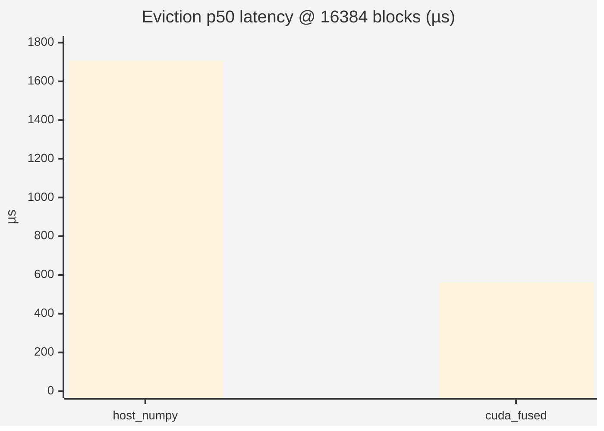
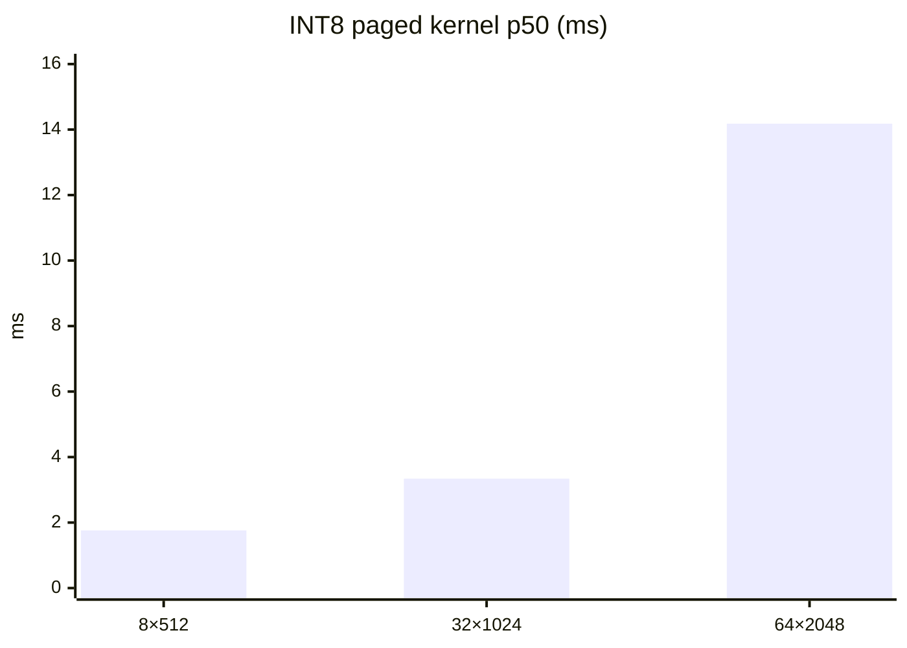
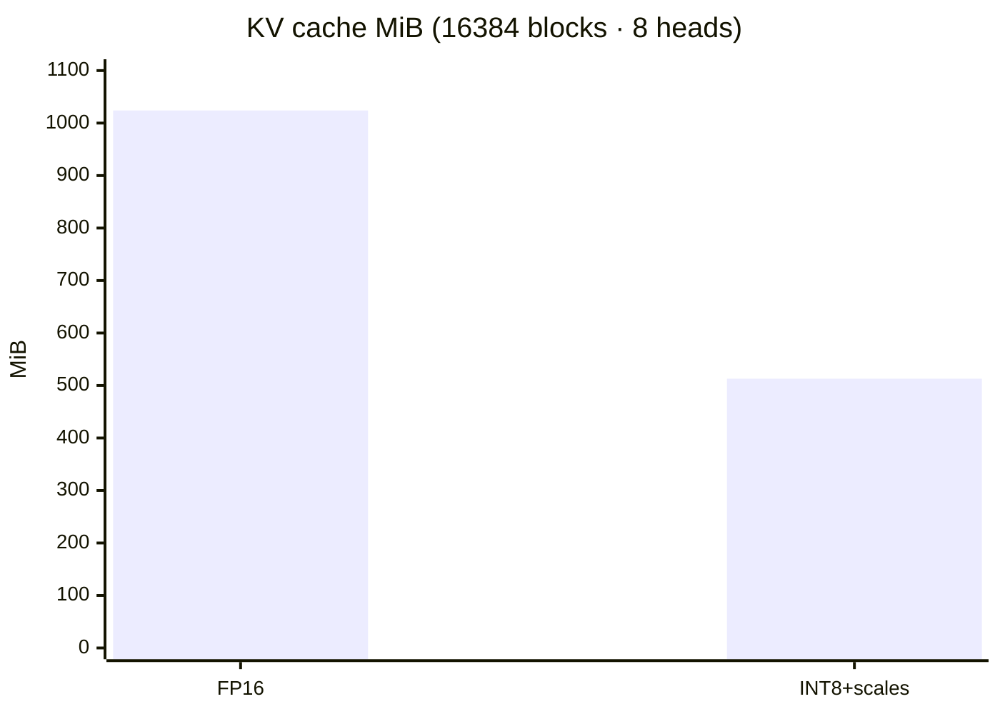
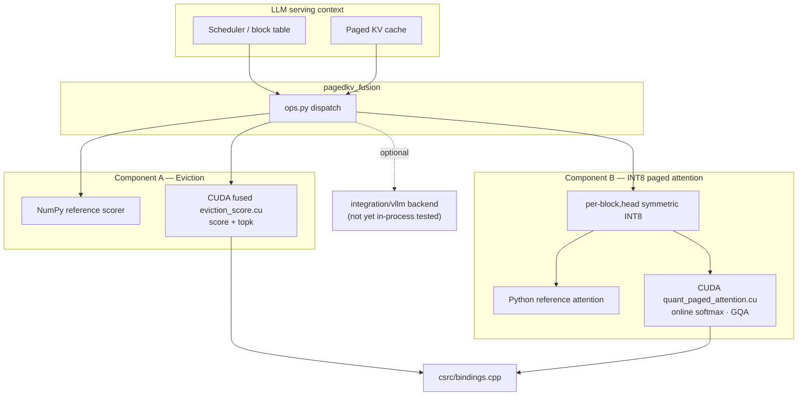
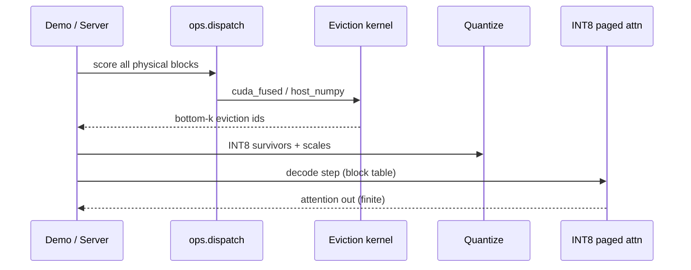
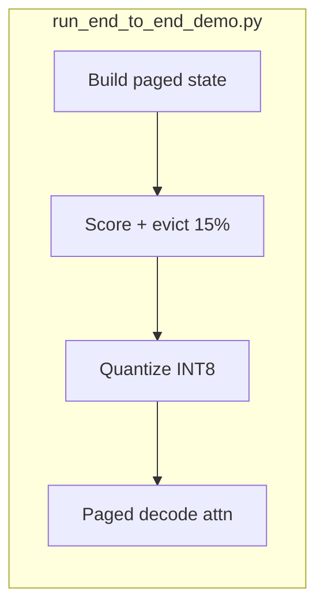
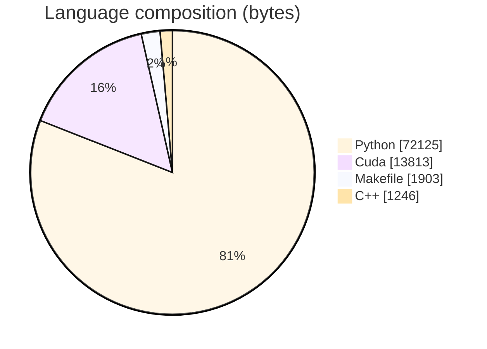

# PagedKV-Fusion

### Custom **CUDA** kernels for **KV-cache eviction scoring** + **INT8 quantized paged attention** — reference-validated, T1000-benchmarked, vLLM-oriented backend (opt-in)

<p align="center">
  
  
  
  
</p>

<p align="center">
  
  
  
  
  <a href="docs/VALIDATION_REPORT.md"></a>
</p>

---

## Overview

**PagedKV-Fusion** (`pagedkv-fusion` **v0.1.1**) ships two production-minded GPU primitives for long-context LLM serving research:

| Component | Role |
|-----------|------|
| **A — Eviction score** | Fused CUDA scoring + top-k over paged KV blocks (`csrc/eviction_score.cu`) |
| **B — INT8 paged attn** | Per-(block, head) quantized decode attention (`csrc/quant_paged_attention.cu`) |
| **Python package** | NumPy/Torch reference + `ops.py` CPU/GPU dispatch |
| **Integration** | Opt-in vLLM backend + patch script — **written, not yet run in-process** |

Portfolio signal for **GPU systems / CUDA / LLM inference**: numerically gated kernels, honest quality failure modes, committed JSON benches, and a written validation report that separates measured vs pending.

> Every number below is copied from [`docs/VALIDATION_REPORT.md`](docs/VALIDATION_REPORT.md) and [`results/*.json`](results/). **Results are not changed.**

---

## Results (committed evidence)

### Test gates

| Suite | Result | Hardware |
|-------|--------|----------|
| Full `pytest tests/` | **26 passed** (~2s) | CPU + NVIDIA **T1000** |
| `tests/test_kernels_gpu.py` | **10/10** kernel vs reference | T1000 · CUDA **12.5** · Torch **2.6.0+cu124** |

### Eviction latency — GPU box (`results/eviction_bench_gpu_sections.json`)

200 timed iterations · `block_size=16` · NVIDIA T1000 8GB

| num_blocks | impl | p50 (µs) | p90 (µs) | Speedup vs host p50 |
|-----------:|------|---------:|---------:|--------------------:|
| 1,024 | `cuda_fused` | **81.0** | **82.2** | ~1.1× |
| 1,024 | `host_numpy` | **90.75** | **114.74** | baseline |
| 16,384 | `cuda_fused` | **562.0** | **590.5** | **~3.0×** |
| 16,384 | `host_numpy` | **1707.75** | **1956.37** | baseline |



CPU-only host baseline (`eviction_bench_cpu_sections.json`): **157.6 µs / 2519.0 µs** p50 at 1,024 / 16,384 blocks.

### INT8 paged-attention throughput (`results/quant_bench_gpu_sections.json`)

| num_seqs | seq_len | INT8 kernel p50 (ms) | fp16 gathered SDPA p50 (ms) | Ratio |
|---------:|--------:|---------------------:|----------------------------:|------:|
| 8 | 512 | **1.76** | **9.01** | **5.1×** |
| 32 | 1024 | **3.34** | **70.00** | **21×** |
| 64 | 2048 | **14.18** | **27,320** | **1,927×** |

> SDPA column is a **dense gather + torch SDPA** upper-bound on a consumer GPU without flash-attn — pathological at large shapes. **INT8 kernel ms** are the primary signal.



### Memory footprint (exact arithmetic · `quant_bench_cpu_sections.json`)

| Config | FP16 MiB | INT8+scales MiB | Savings |
|--------|---------:|----------------:|--------:|
| 4,096 blocks · 8 heads · d=128 | **256.0** | **128.25** | **49.9%** |
| 16,384 · 8 heads · d=128 | **1024.0** | **513.0** | **49.9%** |
| 16,384 · 40 heads · d=128 | **5120.0** | **2565.0** | **49.9%** |



### Quantization quality vs FP32 (CPU reference)

| KV distribution | RMSE | Max abs | FP32 out std |
|-----------------|-----:|--------:|-------------:|
| Gaussian unit variance | **0.00239** | **0.0161** | **0.233** |
| Heavy-tailed (0.1% K ×10) | **0.312** | **3.57** | **7.02** |

Honest read: per-block INT8 is strong on Gaussian-like KV; outliers inflate scale and crush the block — documented failure mode, not glossed over.

### Downstream decision proxy (synthetic — **not** perplexity)

From `downstream_proxy_cpu.json` (2000 trials · 20 concepts):

| seq_len | noise_std | FP32 acc | INT8 acc | disagreement |
|--------:|----------:|---------:|---------:|-------------:|
| 16 | 0.05 | 100% | 100% | **0.0%** |
| 16 | 0.80 | 62.9% | 62.7% | **0.55%** |
| 64 | 0.05 | 100% | 100% | **0.0%** |
| 64 | 0.80 | 97.0% | 97.0% | **0.10%** |

Disagreement stays **&lt; 0.6%** even in the hardest setting.

### End-to-end composition demos

**CPU reference** (`--num-seqs 48 --max-seq-len 768`): 1155 blocks · evict **15%** (173) in **0.71 ms** · INT8 **72.2 → 18.1 MiB (74.9% vs fp32)** · attn **70.38 ms** · total **528.44 ms** · **43/48** seqs touched by eviction.

**CUDA** (T1000): score **568** blocks · evict **85 (15%)** in **0.28 ms** · decode **32** seqs ~**18 ms** · finite outputs.

### Explicitly pending

| Item | Status |
|------|--------|
| Nsight Compute / Systems | Blocked — `ERR_NVGPUCTRPERM` |
| vLLM in-process integration | Adapter present · **not exercised** |
| Real-model perplexity / KV dumps | Not started |
| Datacenter GPU (A100/L4) SLOs | Recommended next |

---

## Architecture







Languages (GitHub): Python **72,125** · Cuda **13,813** · Makefile **1,903** · C++ **1,246** · **38** files.



---

## Repository layout

```text
PagedKV-Fusion-…/
├── csrc/
│   ├── eviction_score.cu
│   ├── quant_paged_attention.cu
│   └── bindings.cpp
├── pagedkv_fusion/          # ops · quantize · reference · testing_utils
├── integration/vllm/        # backend + patch (untested in-process)
├── benchmarks/              # eviction · quant · downstream proxy
├── results/*.json           # committed numbered evidence
├── docs/VALIDATION_REPORT.md
├── scripts/{run_end_to_end_demo,profile_kernels}.py
├── tests/                   # 26 pytest cases
├── docker/Dockerfile.cuda
├── Makefile · pyproject.toml · setup.py
└── LICENSE (Apache-2.0)
```

---

## Quickstart

```bash
git clone https://github.com/ArchanaChetan07/PagedKV-Fusion-Custom-CUDA-Kernels-for-KV-Cache-Eviction-Quantized-Paged-Attention.git
cd PagedKV-Fusion-Custom-CUDA-Kernels-for-KV-Cache-Eviction-Quantized-Paged-Attention

# CPU reference + tests
pip install -e ".[dev]"
pytest tests/ -v
python scripts/run_end_to_end_demo.py

# CUDA extension (GPU machine)
PAGEDKV_FORCE_CUDA=1 pip install -e ".[cuda,dev]" --no-build-isolation
pytest tests/ -v
python benchmarks/bench_eviction.py --num-blocks 1024 16384 --out results/eviction_bench.json
make test demo bench   # see Makefile
```

Reproduction of every claim: [`docs/VALIDATION_REPORT.md`](docs/VALIDATION_REPORT.md). vLLM notes: [`docs/VLLM_INTEGRATION.md`](docs/VLLM_INTEGRATION.md).

---

## Tech stack & keywords

| Layer | Technology |
|-------|------------|
| Kernels | **CUDA** C++ / PyTorch extensions |
| Framework | **PyTorch** 2.6+cu124 (validated), NumPy reference |
| Packaging | setuptools · `pagedkv-fusion` 0.1.1 |
| Quality | **pytest**, ruff, committed JSON benches |
| Serving research | Paged attention · GQA · INT8 KV · eviction · **vLLM** adapter |

**Keyword surface:** CUDA · PyTorch · GPU · KV cache · paged attention · INT8 quantization · eviction · top-k · LLM inference · vLLM · GQA · online softmax · systems · MLOps · pytest · Apache-2.0

---

## What we claim vs what we do not

| Claim | OK? |
|-------|-----|
| CPU math + CUDA kernel numerical gates | **Yes** — 26/26 |
| T1000 eviction / INT8 latency numbers in `results/` | **Yes** |
| ~50% KV memory vs fp16 | **Yes** — arithmetic |
| Real model perplexity / production SLO | **No** |
| vLLM process integration proven | **No** |

---

<p align="center">
  <b>PagedKV-Fusion</b> · Apache-2.0<br/>
  <a href="https://github.com/ArchanaChetan07/PagedKV-Fusion-Custom-CUDA-Kernels-for-KV-Cache-Eviction-Quantized-Paged-Attention">github.com/ArchanaChetan07/PagedKV-Fusion-…</a>
</p>
